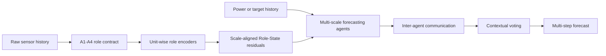

# MASPGE-RS

**Role-Conditioned Multi-Agent Forecasting for Heterogeneous Industrial Energy Systems**

MASPGE-RS maps heterogeneous sensor histories into four reusable functional
roles and injects unit-wise, scale-aligned Role-State residuals into a frozen
multi-agent forecasting backbone. The same model structure is used for wind
farms and thermal/hydro energy processes; only sensor mappings and active-role
masks change across datasets.

## Method at a glance



- **A1:** energy input and operating conditions
- **A2:** energy conversion
- **A3:** generation and grid interface
- **A4:** auxiliary systems

Missing roles and sensor slots are handled by frozen masks rather than by
changing the architecture for each dataset.

## Repository scope

This is a clean release of the final MASPGE-RS research line. It excludes
discarded development branches such as field-level vote routing and HardTopK
communication. It contains:

- the MASPGE-RS model and adapted MAFS backbone;
- deterministic data contracts for SMARTEOLE, SDWPF, and HAI 23.05;
- validation-first training and read-only holdout evaluators;
- external-baseline, multi-horizon, and structural-ablation entry points;
- frozen paper-result CSV files and focused automated tests.

Datasets, checkpoints, logs, and large generated outputs are not committed.

## Installation

Python 3.10 or 3.11 is recommended.

```bash
python3 -m venv .venv
source .venv/bin/activate
python -m pip install --upgrade pip
python -m pip install -r requirements.txt
export PYTHONPATH="$PWD/src"
python -m pytest -q
```

For RTX 50-series GPUs, install a PyTorch build compatible with the local CUDA
driver first. The frozen workstation run used PyTorch `2.11.0+cu128` on two
RTX 5090 GPUs.

## Data preparation

Download the datasets from their official sources and follow
[`data/README.md`](data/README.md). Verify hashes and tensor contracts before
training:

```bash
python scripts/verify_setup.py
python scripts/verify_sdwpf_role_state_setup.py
python scripts/verify_hai_role_state_setup.py
```

## Core training pipeline

MASPGE-RS follows three stages: multi-scale agent specialization, inter-agent
communication/voting, and frozen-backbone Role-State adaptation.

```bash
# Produce validation-selected Stage-II MAFS bases for SMARTEOLE and SDWPF
bash scripts/run_mafs_base_2gpu.sh

# SMARTEOLE: five-seed full validation
bash scripts/run_role_state_full_validation_2gpu.sh

# SDWPF: five-seed cross-dataset validation
bash scripts/run_sdwpf_role_state_formal_2gpu.sh

# HAI: five-seed validation with A1-A4 active
bash scripts/run_hai_role_state_validation_2gpu.sh
```

The launchers stream progress, are restart-safe, and write JSON results and
best-validation checkpoints under ignored directories. Holdout evaluation is
kept in separate scripts with no training path.

## Structural ablation

The frozen ablation matrix tests the final method directly:

- `w/o Unit-wise`: all units receive the same unit-average role state;
- `w/o Scale Alignment`: every expert receives the full role-history window;
- `w/o A4`: HAI auxiliary-role conditioning is disabled while parameter slots
  are preserved.

```bash
bash scripts/run_role_state_ablation_v1_2gpu.sh
```

## Frozen main results

Five-seed mean MSE values are summarized below. Full MSE/MAE values and
standard deviations are stored in
[`paper_results/main_results.csv`](paper_results/main_results.csv).

| Method | SMARTEOLE | SDWPF | HAI |
|---|---:|---:|---:|
| iTransformer | 0.022912 | 0.144227 | 0.008582 |
| SOFTS | 0.022541 | 0.137760 | 0.008588 |
| TimeMixer | 0.023453 | 0.152861 | 0.008620 |
| MAFS (adapted) | 0.022257 | 0.134618 | 0.007650 |
| **MASPGE-RS** | **0.021954** | **0.126167** | **0.005958** |

MASPGE-RS reduces MSE relative to the same adapted MAFS backbone by 1.36%,
6.28%, and 22.12% on SMARTEOLE, SDWPF, and HAI. These are experimental
results, not a claim of statistical significance. SMARTEOLE and SDWPF
holdouts were observed during earlier development; HAI provides the strongest
frozen holdout evidence. See
[`docs/REPRODUCIBILITY.md`](docs/REPRODUCIBILITY.md) for the full boundary.

## License and citation

MASPGE-RS is released under the MIT License. Adapted baseline components retain
their original notices under [`licenses/`](licenses/) and are documented in
[`THIRD_PARTY.md`](THIRD_PARTY.md). Dataset licenses are independent of the
software license. A provisional citation is provided in
[`CITATION.cff`](CITATION.cff) and will be updated after publication.
